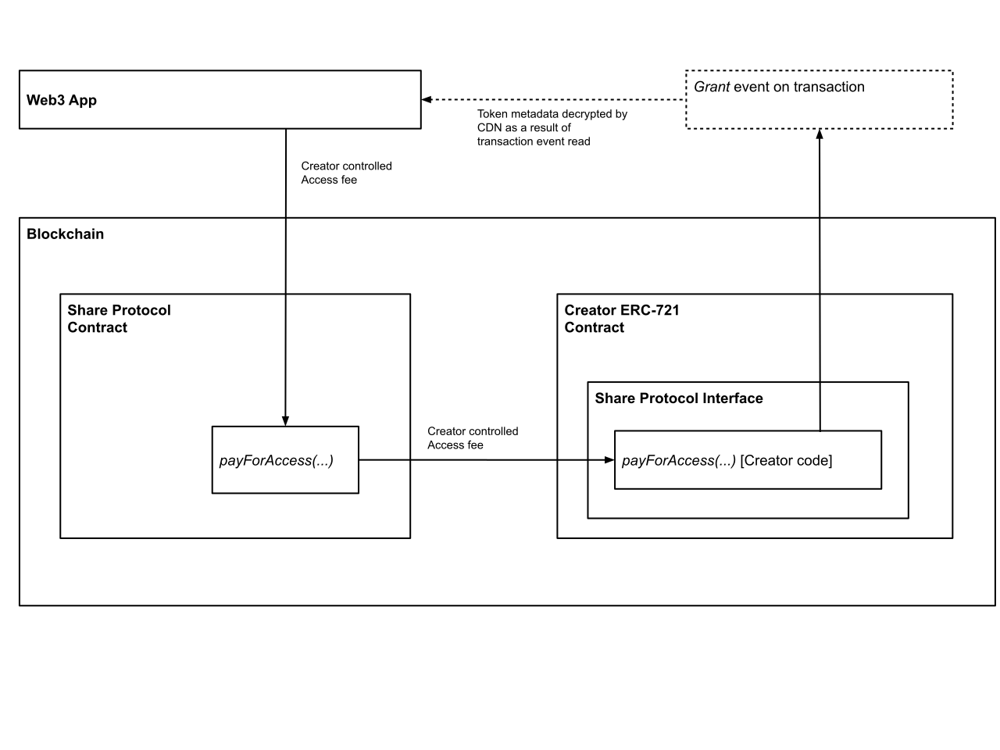
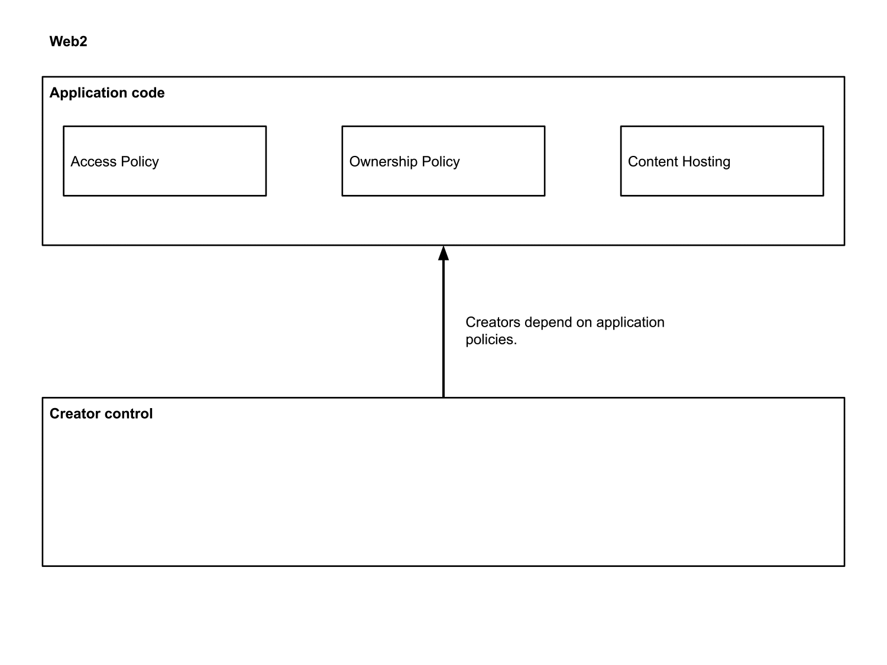
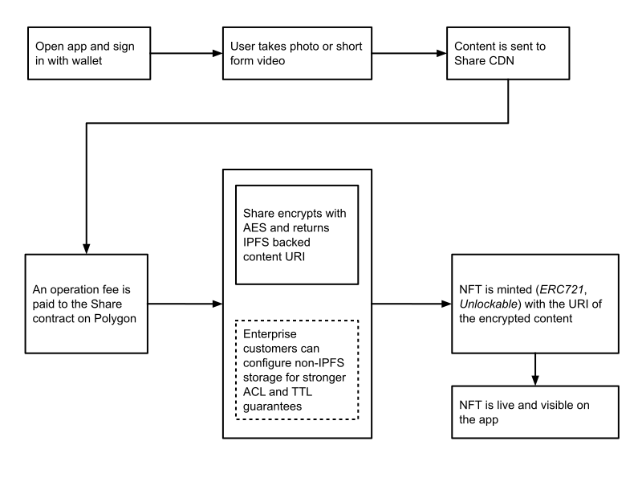
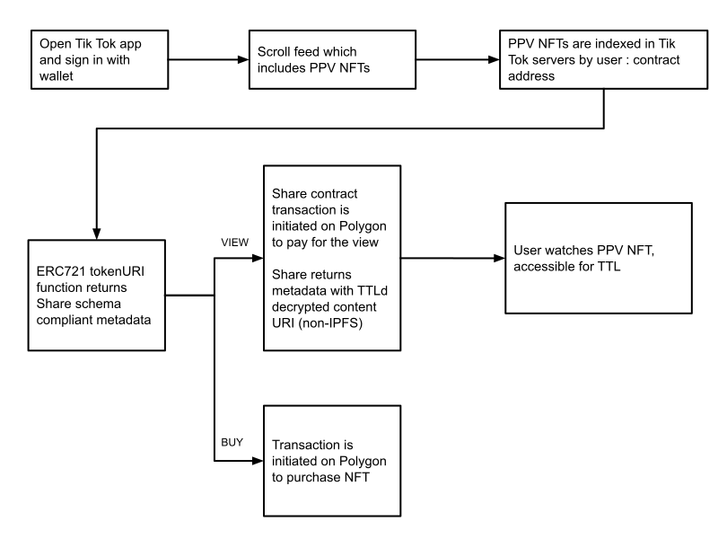
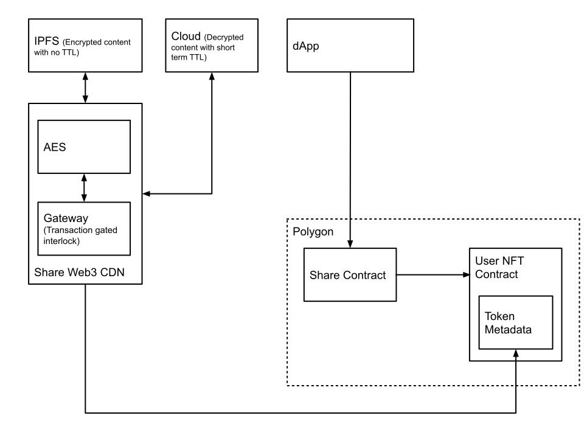
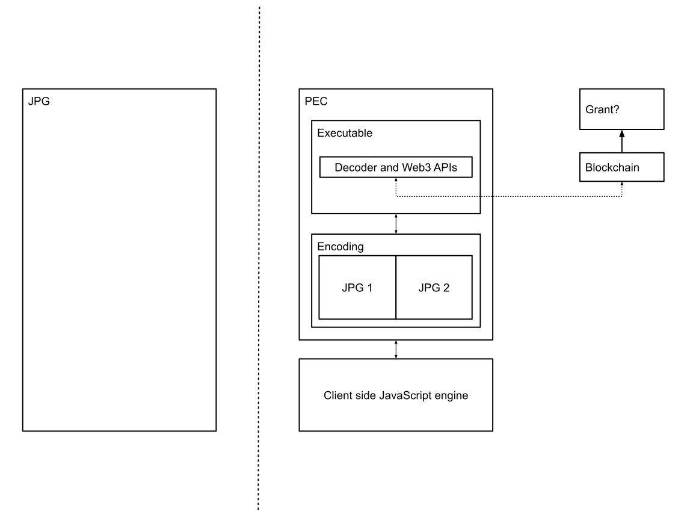

# Share: Digital Content Access Inversion

author: brandon@formless.xyz<br>
All rights reserved.

## Abstract

Imagine you’re a musician, and you have an audience of 1000 people. You post a song, one of the most intimate, beautiful creations you have ever made to the blockchain. You set the price to experience the content at $1, and share it with the people who couldn't wait to hear it. The song itself is a revenue generating, tradeable asset, that can be unlocked using an instant microtransaction with no sign in. It's available everywhere in the metaverse in perpetuity. Your audience grows and you repeat. Your classic pieces start to generate even more monthly revenue, enabling you to create even better content. Fans can even buy into the content so that they receive a portion of the future revenues as well. This is a decentralized pay-for-access digital content marketplace. Not only is it a marketplace to collect the content, but a marketplace to experience the content.

Share is a decentralized streaming platform and protocol that combines Youtube and Spotify into one app, but reimagined, and using pay-per-view microtransactions on blockchain. Users instantly authenticate without signing in, and for every time they watch, listen to or read your content, a fast micropayment grants access. Most importantly, the price of the micropayment is set **by the creator**. It can range from being free, to upwards of hundreds of dollars per experience. The creator decides, not the platform. Share inverts the access model.

This paper is a technical deep dive into the Share architecture and protocol. The intended audience is technical, but the paper begins by establishing some of the history and background of the creator economy and Web3 spaces in order to contextualize the design for readers who may not be as familiar.

## Background

Smart contracts have established a public, immutable chain of digital asset ownership, unlocking a world of possibilities for trading value on permissionless exchanges. What we haven't seen as widely used yet are the capabilities which go beyond the Non-Fungible Token (NFT) standard, allowing content creators to specify additional behavior within their work. In some cases this behavior has been used to create generative content, e.g. art that can change as the result of code execution. However in this paper we consider the possibilities of specifying the rules of access of the content, rather than the generative qualities. We posit that in addition to scalable ownership this is a second fundamental feature of Web3.

We define a living data format as a uniquely tokenized asset which would allow digital content creators to set their prices, and receive instant payments, in perpetuity. Historically the thought of a living data format is analogous to a unique "program" or "microservice" that executes code. The technical challenge here has been that mainstream servers which host creator content cannot allow remote code execution (RCE) for a number of valid reasons. Also, it is unreasonable to expect creators to maintain servers which host executable content themselves. Blockchain changes this since servers can now execute small portions of creator-specified code in a safe, transactional environment known as the Ethereum Virtual Machine.

Share is a protocol which uniquely positions creators to establish the rules of access for their digital content. Using the Share protocol, distribution platforms and Web3 user interfaces bend to the rules of creators (e.g. price to buy, price to experience, price to advertise etc.), rather than the inverse.

## Creator Economy

For many years a concern within the entertainment industry was protecting content owned by big companies from the would-be millions of suspected pirating consumers. Today, the question we aim to answer is, "How do we protect millions of creators from big companies?" And, as Web3 development accelerates, "How do we protect millions of creators from VCs and technologists becoming the new gatekeepers of Web3?"

The mainstream creator economy is broken because it lacks the natural occurrence of supply and demand. The price paid to creators is static, arbitrary and determined solely by the large platforms that distribute the content, eliminating free market price discovery and instead optimizing for their own profit. Unlike other industries where owners set their product price based on a number of unique business factors, blanket pay per click rates are applied to digital content, creating an uber-competitive clickbait driven ecosystem largely monetized using pooled ad revenue and subscriptions. Share adds a protocol layer within smart contract infrastructure to enable creator controlled Pay-For-Access (PFA) NFTs.

## Non-Fungible Tokens (NFTs)

It is generally well known that the supply and demand problem mentioned above is being partially solved today with existing NFTs, e.g. we're seeing a transformation where creators set their own prices for the sale of their content. However, mainstream users tend to use the best user experience regardless of what's happening in the NFT space. The best user experiences are created by large influxes of capital. If creators are not cautious about influencing contract and protocol level decisions, entities with the most capital will shape the business model for creators.

Share takes advantage of the fact that creators have leverage at the content layer of the Web3 stack. This means that while NFT standards are controlled by the developer community and applications are largely controlled by the VC community, under the Share protocol the content and metadata underlying the NFT remains creator controlled territory. The Share metadata schema renders NFT content cross-platform compatible, meaning the same NFTs can light up in any application. There is no walled garden.

## Creator Code Execution

To illustrate the power of Web3 (any by extension Share), consider the fact that a creator cannot execute even the simplest of their own code on a Youtube server. Even if one could, this code would not work on a Spotify server. Blockchain provides an execution environment for running creator specified code. While it can be costly to run this code, we posit that the code only requires very limited stateful behavior to have a massive impact: confirming financial transactions and updating state variables readable by decentralized content delivery networks.

As a result one can run the following code from any server: "Check if entity **N** paid what I've asked for", alongside providing access to the content in memory. Many NFTs today are not exploiting this fact simply because the ERC-721 (Ethereum Request for Comment Number 721) token metadata standard was not explicitly designed for content creators, but rather for maximum flexibility. Many creators are using aggregate ERC-721 contracts specified by their minting platform, rather than their own smart contracts. Share introduces a layer which uses this metadata as a transaction based interlock between producer and consumer at every observable entrypoint of the content.



The diagram above shows the entity relationship between a given decentralized application, the Share protocol contract and creator NFTs. Note that the Solidity code which ultimately confirms the payment transaction for access is housed fully within the creator controlled contract.

Standard NFT token metadata containing the content URI is read from the NFT by the dApp, however the content which the URI points to is decrypted if and only if the payment transaction event can be found on the blockchain for the address of the viewer.



The animation above highlights the way in which this architecture is different from solutions which exist today and in the past. In Web2, the terms of access for creator content, e.g. the code which sets the price-per-stream on Spotify, are completely specified and executed on 3rd party centralized infrastructure. Additionally, the ownership terms and content are hosted on the same centralized application service layer.

In Web3 today, the ownership terms and content have been pulled out of the centralized application layer and into the blockchain layer, giving creators sovereignty over those terms. However in Web3 with Share, the dependency is **fully** inverted, as the access terms are also pulled into the blockchain layer. Meaning creators don't just set the price for owning the content, they set the price for experiencing the content. With Share, both Web3 and Web2 applications are able to unlock creator content using the Share contract on blockchain which actuates the unlock mechanism within the creator smart contract in order to serve the decrypted content URI.

## Governance

Decentralized communities often require governance. In Web3 this is typically achieved using a governance token, which may also act as a utility token to incentivize behaviors within the community. Governance is a good solution to many problems in the decentralized internet, however it is mostly insufficient for creators.

Governance enables power structures (e.g. community members with unusually large access to capital or social capital) to re-emerge within Web3, and, if not properly checked, introduce business terms that may not make sense for artists.

Consider Web3 platforms emerging today with relatively arbitrary features and rules. In addition to _decentralizing_ the control (e.g. putting it into the hands of the community) Share fully _inverts_ the terms of access. This means that anything regarding the rules of access (e.g. price model, hosting terms, viewership) is **governed by the creator alone**.

To do this Share adds an additional layer to the NFT backbone which specifies how the actual content is mechanically actuated from within the token. This is largely an afterthought in NFT communities today. Many creators are minting NFTs as token identifiers within aggregate contracts controlled by a governance structure rather than minting their own ERC-721 implementations. These contracts use persistent plaintext storage like CDNs or IPFS to store the actual content file. Share takes advantage of this as an opportunity to introduce creator control and additional revenue streams for the creator ecosystem.

## Pay-For-Access (PFA) Smart Contracts

At the core of Share is the idea of a Pay-For-Access smart contract. The price per access (e.g. view or listen) can be set to $0 as is today for nearly all NFTs, but it can also be set to a non-zero value if the creator chooses. This means that content will exist which cannot be observed until a micropayment is recorded on the blockchain. In order to enable high volume transactions at low cost, Share is built on the Polygon L2 Proof of Stake sidechain. Additional details are discussed below in "Layer 2 Optimizations".

Unlockable PFA experiences at scale can create immense impact for creators. At high volume, micro payment transactions on observables are much more sustainable than trying to sell a single NFT for a high price to one buyer. Rallying a community to establish value around an NFT can be a stressful endeavour for artists, and an alternative model is to be paid a creator-specified price for the ability to experience the art. By putting more content monetization options into the hands of creators, Share enables them to _choose_ which combination of models work best for their business.

We call tokens which conform to the Share protocol "Green NFTs" or G-NFTs. Green is often associated with the color of life, renewal, nature, and energy. G-NFTs are Non-Fungible Fokens with living, creator-controlled content. "Green" means that the content housed within the NFT has creator controlled terms of access for its lifetime. G-NFT content is "living" and revenue streams flow to creators on each view or displayed ad for the lifetime of the art, independent of a sale of the contract itself.

Applications can also act as agents on behalf of users by paying for the PFA content access using their own revenue and presenting the experience to users for free, or at a surcharge. Share unlocks new business opportunities and market competition for application developers.

```solidity
interface GNFT {
    /// @dev This emits when the recipient address has successfully been
    /// granted access to the NFT content associated with the tokenId. The content
    /// can be read using the ERC721Metadata standard, e.g. tokenURI. The returned metadata
    /// will include the content decrypted by the Share CDN, after ACK of the
    /// interlock "Grant" event emitted within the creator controlled access function.
    event Grant(address indexed _recipient, uint256 indexed _tokenId);

    /// @notice Returns non-zero value in gwei if this NFT requires payment for access and
    /// zero otherwise.
    function pricePerAccess() external returns (uint256);

    /// @notice Grants or denies access to NFT content based on creator controlled terms
    /// @param _tokenId The identifier for an NFT
    function access(uint256 _tokenId) external payable;
}
```

## Example: Pay-For-Access Content in the Metaverse with Share

<p align="center">
	
</p>

The diagram above exhibits a user journey for **creating** a Pay-For-Access NFT using Share any social media application in the metaverse.

<p align="center">
	
</p>

The diagram above exhibits a user journey for **experiencing** a Pay-For-Access NFT using Share using any social media application in the metaverse.

## Share Web3 Sponsorship Delivery Networks (SDN)

In addition to CDNs with transaction gated interlocks, Share introduces SDNs or "Sponsorship Delivery Networks". These are a set of decentralized services which deliver sponsored content into user experiences based on creator specified terms. This means NFT creators can enable ad revenue on their NFTs.

In the Share protocol, creators specify their own terms for ads, e.g. they set the price, and they choose the advertisers. SDNs and CDNs execute creator code on the EVM and serve the content to the presentation layer.

The vision is not to bring traditional advertising to Web3 but instead to enable artist curated sponsorships that are thoughtfully placed and non-disruptive to the user experience. We believe there's an aesthetically pleasing balance to be achieved which mutually benefits creators, consumers and sponsoring brands.

<p align="center">
	
</p>

The diagram above shows the entity relationship between Share decentralized CDNs, IPFS and NFTs which use Share CDNs for serving creator controlled token URIs. Share introduces a contract between the tokenURI, metadata and the CDN which unlocks content based on the presence of blockchain micro transactions and honors the rules specified in the creator contract. This system contains no single point of failure since at any time a creator can update their contract code to point to a different IPFS gateway or CDN.

We use the NFT only as the infrastructure to transact ownership, and the metadata schema as the contractual mechanism to dictate creative control. We believe that creators today have the leverage to dictate this interface, and applications will adapt.

## Share Metadata Schema

The code example below show a JSON schema for Share NFT metadata:

```json
[
  {
    "title": "SONG XYZ",
    "properties": {
      "name": "SONG XYZ",
      "description": "NOP",
      "image": "NOP",
      "artist": "ARTIST X COLLABORATOR",
      "type": "audio",
      "uri": "share.ipfs.xyz/1",
      "artwork": {
        "properties": {
          "type": "image",
          "uri": "share.ipfs.xyz/2"
        }
      }
    },
    "sponsors": [
      {
        "title": "Nike",
        "properties": {
          "message": "Express your versatility, score from anywhere.",
          "uri": "share.ipfs.xyz/3",
          "link": "https://nike.com"
        }
      }
    ]
  },
  {
    "title": "VIDEO XYZ",
    "properties": {
      "name": "VIDEO XYZ",
      "description": "NOP",
      "image": "NOP",
      "artist": "ARTIST X COLLABORATOR",
      "type": "video",
      "uri": "share.ipfs.xyz/4"
    },
    "sponsors": [
      {
        "title": "Adidas",
        "properties": {
          "message": "Into the metaverse.",
          "uri": "share.ipfs.xyz/5",
          "link": "https://adidas.com"
        }
      }
    ]
  }
]
```

## Layer 2 Optimizations using Polygon

For Pay-For-Access G-NFTs with unlockable experiences to work, a near $0 transaction fee is required, otherwise the transaction fee might strongly exceed the price for access. Transaction fees are a well known bottleneck for micropayments in Web3.

L2 layers can operate as federated networks of nodes which perform high speed, low-fee transactions and perform latent writes back to L1 main chains. The latent writes do not contain the actual transaction data, but rather an encoded structure which can be used to validate the existence of a transaction without needing the entire record. Effectively, this batches transaction knowledge into a compressed, and therefore cheaper, version known as ZK rollups to store on L1.

This technology will be essential for the long horizon of Web3 and is a perfect fit for storing bulk transaction data such as access grants. For these reasons Share is built using the Polygon L2 Ethereum sidechain. Since the Polygon API maps to Ethereum identically, Share will also natively support ETH2 in the future.

## Ownership, Trading and Fractionalization

Traditional NFT ownership, trading and fractionalization opportunities exist in addition to the PFA contract terms. Content which adopts the Share protocol can be viewed on any platform which supports the ERC-721 standard. The primary distinction is whether the artist decides to charge a micropayment for the experience itself, in which case the user interface must provide the user with a mechanism for signing the payment, otherwise only a preview is shown. Since most applications do not do this today, we imagine a new set of G-NFT friendly application launches emerging that support this feature as an advantage for attracting creators to use their apps.

Fractionalization of NFTs is another monetization opportunity for artists. That said, Share fully complies with SEC definitions around securities, and does not endorse any market making practice for fractionalized NFTs which would violate SEC guidelines which exist now or in the future. From a technical perspective, fractionalizing the copyright of a Share protocol compliant NFT involves the creation of an ERC-20 custodial contract which exposes fractional token-based ownership of the copyright that underlies the referenced root ERC-721 token. The ERC-721 token owner is then set to the address of the ERC-20 contract, and the ERC-20 tokens can be exchanged on any decentralized exchange where liquidity for the token exists. Initial liquidity can be provided by an artist, e.g. by staking a pair which comprises their ERC-20 and another liquid assets such as ETH. Artist executed copyright assignment agreement is encapsulated within the ERC-721 metadata which denotes token holders as rights holders of the copyright. This is (optionally) done under the hood in the Share application, and is a feature for artists that wish to fractionalize ownership with their community.

All PFA and sales revenue is sharded according to the rights holders as specified by their addresses in the creator contract. For large computations (e.g. for a large number of fractions) off-chain processing is done using blockchain indexing (e.g. TheGraph) at predetermined intervals, and accrued revenues are available for withdrawal from the contract at those times. By default, non-fractionalized NFTs with a small number of collaborators are configured to send instant payment to contract owners at the time of the access grant transaction.

## Executable Content

Share also introduces an additional file format for encoding content: Portable Executable Content (patent pending), or "PEC". PEC files are lightweight containers that place executable code into media formats (e.g. JPEG, PNG, WAV, MP4), enabling Web3 creator code to execute client side. This enables blockchain transaction verification logic to run in a more scalable way, without dependence on a 3rd party CDN service to host and execute the logic. For users especially interested in decentralization this elides the requirement of using a CDN for storage and enables even PFA content to be stored using IPFS. That said, it is our position that access inversion is more important than decentralization for creators, e.g. it matters more that access policies are creator specified, than that they are purely decentralized.

<p align="center">
	
</p>

## Exporting Content and Minting

Share will provide a suite of plugins for exporting and minting G-NFT content, e.g. content files along with with contract code, directly from top editing suites such as Pro Tools, Ableton Live, Fruity Loops and Adobe Creative Suite.

## Sponsor Tools

Share will create backend tools for sponsors that enable them to publish ads and identify creators accepting ad buy proposals. Share content sponsorship is by default charged by duration. This means creators can offer ad slots with terms such as "image below video for 30 days at price $N" and advertisers can pay for this package in its entirety up front.

Since G-NFT contracts are transparent and fully visible on the blockchain, transaction activity and revenue is openly available to advertisers and the public. Share will also provide more advanced tools to optimize advertiser spending. The Share protocol represents advertisement smart contracts stored on chain, enabling artists to have complete control of the code which specifies the terms of an acceptable advertiser. Once an ad contract is purchased, SDNs automatically serve approved ads as IPFS backed content URIs within token metadata as shown in the above schema.

## Streaming, Curation and Playlisting

In Share, all experiences: songs, videos, albums, playlists are smart contracts. While a single song may have a Pay-For-Access price of $0.50, an entire album can also be represented as a G-NFT with a PFA price of $5.00. Similarly a curated playlist with 20 songs can be represented as a G-NFT with a PFA price set by the curator. All revenue will flow automatically to co-creators specified in the underlying smart contracts.

This model gives artists, curators and consumers maximum flexibility for creating, experiencing, and reselling revenue generating G-NFTs on secondary markets. In the future we envision many G-NFT friendly applications that provide users with incredible experiences, and can independently access the same content off of a global ledger while paying rights holders fairly and efficiently.

## Team

https://www.formless.xyz/team<br>
© 2022<br>
formless<br>
